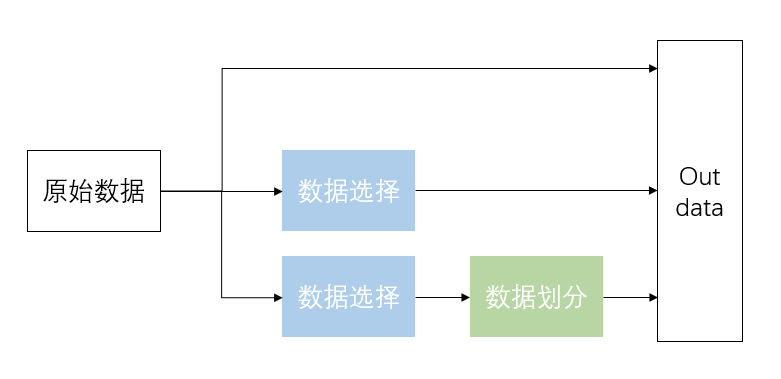

# 作用

本仓库主要应用于深度学习中对分类数据集的管理

1. 不同数据层级不同自由读取

   - `Omniglot`
     - 李宏毅的元学习中提到该数据集，是一个语言文字数据集。
     - 该数据集有三层文件，从上往下依次是文件根目录、不同国家、不同国家的不同文字。
     - 那么在 `Dataset`中，从根目录出发，就需要有3次`for`循环才能查找到某个文字集合的所有手写文字

   - 传统数据集
     - 通常只有两层文件，从上往下依次是文件根目录、不同类别的数据
       - 那么在 `Dataset`中，从根目录出发，2次`for`循环就能查找到某个类别的所有数据

2. `train/val/test`的划分
   - 在训练时，通常会将数据集进行划分，那么传统的方式就是新建文件，按照比例将原始数据复制到新的文件夹中
   - 开辟新的内存空间并且复制数据，浪费时间，也占用空间

3. 选择部分数据
   - 有时有的数据非常大，无法用这个数据进行训练，那么选择其中的部分数据进行训练

# 项目结构

```
DataMap/
├── main.py                 # 主程序入口
├── utils/
│   ├── __init__.py         # 工具模块初始化
│   ├── logger.py           # 日志配置
│   └── file_utils.py       # 文件读写工具
└── core/
    ├── __init__.py         # 核心功能模块初始化
    ├── processor.py        # 数据处理器基类
    ├── selector.py         # 类别选择功能
    └── splitter.py         # 数据划分功能
```


# `main.py`程序逻辑



